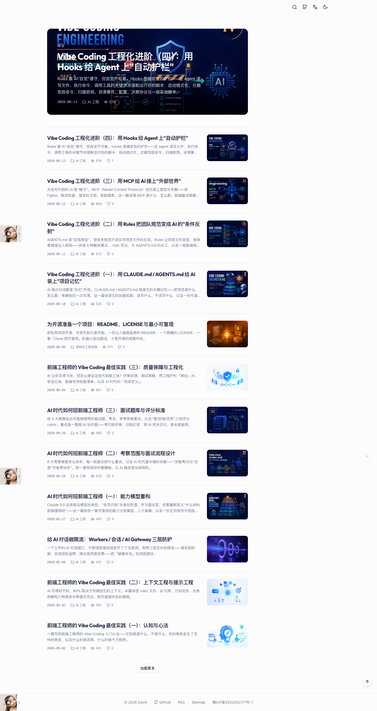

# andy-blog-web

Gavin 的博客前端：**Nuxt 4 SSR + Tailwind CSS v4 + shadcn-vue**。

<p align="center">
  
</p>

## 技术栈

- Nuxt 4（Vue 3.5 / Nitro），`useAsyncData` 同构数据获取，无额外状态管理库
- Tailwind CSS v4（`@tailwindcss/vite`，CSS-first `@theme` 配置）+ `@tailwindcss/typography`
- shadcn-vue（reka-ui）UI 组件：Button / Sheet / Dialog / Badge / Input …
- 暗色模式：`@nuxtjs/color-mode`（class 策略，无 FOUC）+ Tailwind `@custom-variant dark`
- SSR 页面缓存：`routeRules` SWR（首页/文章 60s，分类/标签/归档/关于 300s）
- RSS / sitemap：Nitro server routes（`defineCachedEventHandler` 缓存）
- 文章渲染：marked + highlight.js，渲染时注入标题锚点并提取 TOC（侧栏滚动高亮）
- 布局：1152px 双栏（主列 + sticky 右侧栏），`<lg` 收起侧栏、导航进抽屉
- 音乐播放器：APlayer（`<ClientOnly>` 客户端挂载）

## 目录结构

```
app/
├── app.vue / error.vue / layouts/default.vue
├── pages/              # index / article/[id] / category/[id] / tag/[id]
│                       # archive / guestbook / about / search/[keyword] / [...slug](404)
├── components/         # SiteHeader(抽屉) / PageShell(双栏) / SidebarDefault / ArticleToc
│   └── ui/             # shadcn-vue 生成组件
├── composables/        # useBlogApi / useBlogData / useIdentity / useStaticUrl
├── utils/              # markdown(TOC) / static-url / date
├── configs/            # 歌单静态数据
└── assets/css/main.css # Tailwind v4 @theme 主题（电光蓝/墨蓝/暗色蓝灰）
server/
├── routes/             # rss.xml.ts / sitemap.xml.ts
└── utils/blog-api.ts   # Nitro 侧 API 调用（内网地址优先）
shared/                 # meta.ts / types.ts（app 与 server 共用）
nuxt.config.ts          # 模块 / runtimeConfig / routeRules
```

## 开发

```bash
npm install
npm run dev      # nuxt dev，默认 3000 端口
```

推荐通过 `andy-blog-deploy` 的 `make dev` 启动完整环境（api/mongo/redis/web/admin）。

## 构建与运行

```bash
npm run build    # nuxt build → .output/（自包含，无需 node_modules）
npm run start    # node .output/server/index.mjs
```

## 运行时环境变量

| 变量 | 说明 |
| --- | --- |
| `PORT` | 监听端口，默认 3000 |
| `NUXT_PUBLIC_API_BASE` | 浏览器可达的 API 地址（如 `https://api.jiawen.live`） |
| `NUXT_API_BASE_INTERNAL` | SSR 数据预取内网地址（如 `http://api:3000`） |
| `NUXT_PUBLIC_STATIC_PATH` | 静态资源域名（支持逗号分隔多个） |
| `NUXT_PUBLIC_WECHAT_SHARE_ICON` | 微信分享默认缩略图绝对 URL；留空则使用站点根路径 `/share-icon.jpg` |
| `NUXT_PUBLIC_WECHAT_JSSDK` | 仅认证公众号设为 `true`。未认证时不要开，否则分享卡片会没缩略图 |

运行时配置经 Nuxt `runtimeConfig` 注入，构建产物多环境通用。
